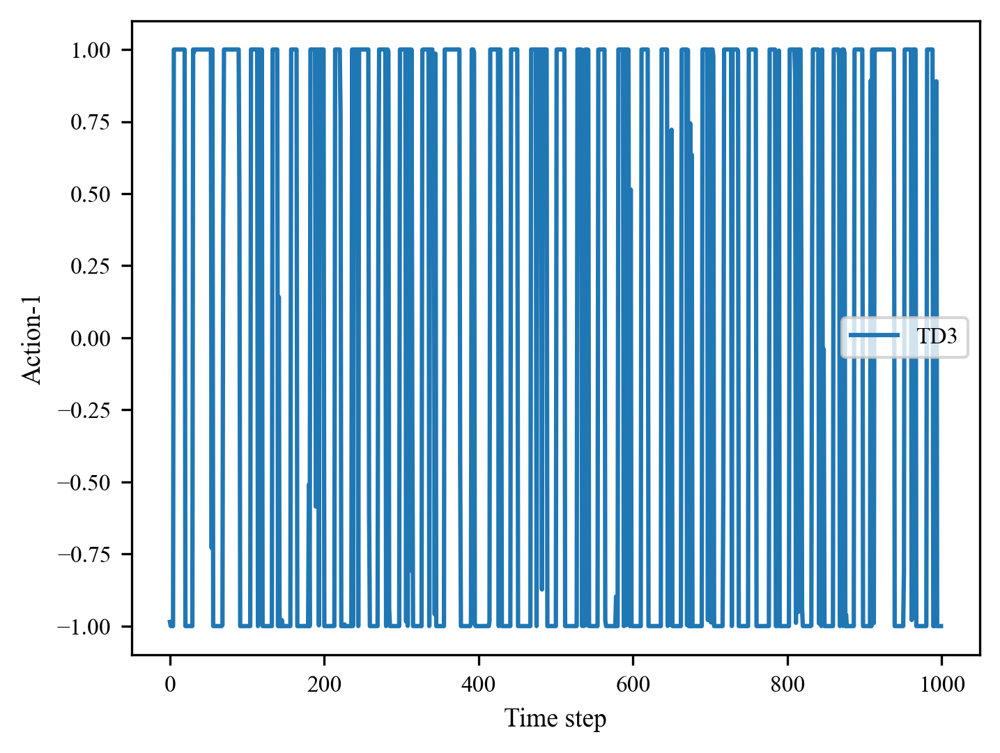

# ICML 2023 Rebuttal: LipsNet

## For reviewer \#1vnG
To demonstrate why LipsNet is highly effective at attenuating action fluctuation in some environments (e.g., LQR, vehicle trajectory tracking, CartPole, Reacher), we visualize the Reacher environment with observation noise.

In Reacher environment, we need to apply force and make the pole's endpoint keep inside the target red sphere.
The position of target sphere is randomly initialized.

- Reacher: TD3 (MLP)

https://user-images.githubusercontent.com/33803151/226159136-2412f7cf-867f-4cf1-b3e8-95bb1129756d.mov

 

- Reacher: TD3 (LipsNet-L)

https://user-images.githubusercontent.com/33803151/226159138-f294e249-1899-4a8d-b6e5-a892354a4818.mov

 

The above vidoes show that:
1. The maximum steps in Reacher is 1000, but only a few steps (about 100 steps) are need to rotate the endpoint inside the target sphere.
2. After the endpoint inside target sphere, the MLP poliy produce fluctuating action due to observation noise.
2. After the endpoint inside target sphere, the LipsNet poliy produce stable action (nearly zero changing).

Therefore, LipsNet can keep almost unchanged action after the first few steps. However, MLP has fluctuating action in all the 1000 steps. This is the exact reason why LipsNet is highly effective in this kind of environments.

As for the Cheetah environment, the actions need to change rapidly between -1 and 1 to make cheetah move fast.
The following figures visualize the first two dimensions of action to illustrate it (actually, this rapid change presents in all 6 action dimensions).
To maintain good enough control performance, LipsNet do not change this phenomenon by reducing Lipschitz constant.
Therefore, LipsNet is less effective at attenuating action fluctuation on Cheetah because of the nature of the task.

- The first dimension of action in Cheetah

- The second dimension of action in Cheetah

