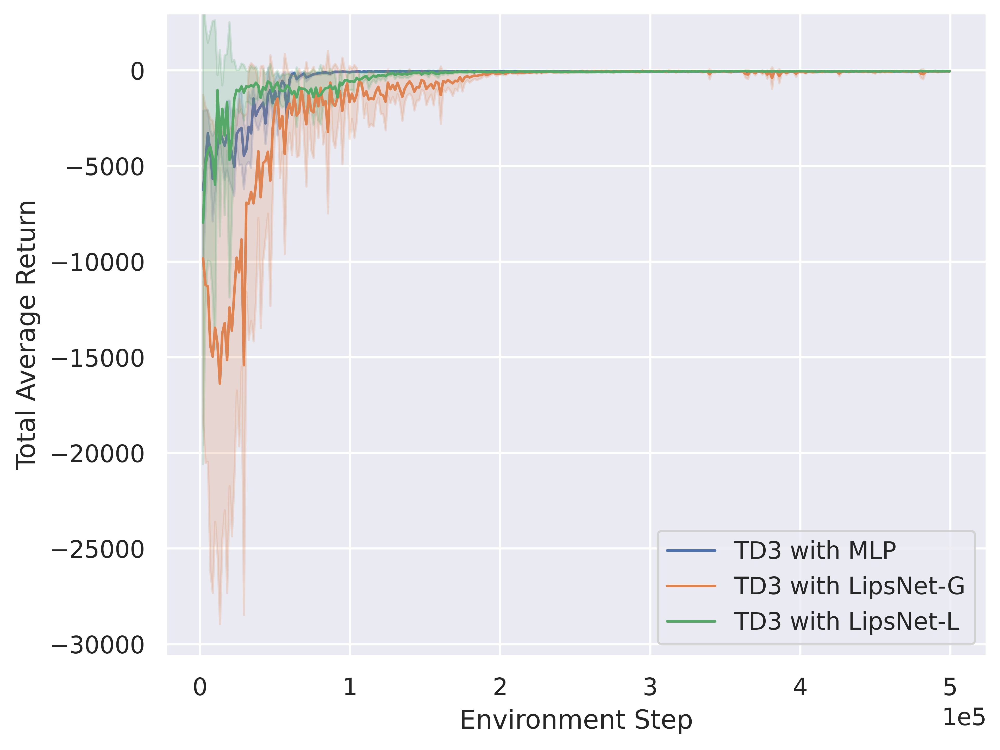
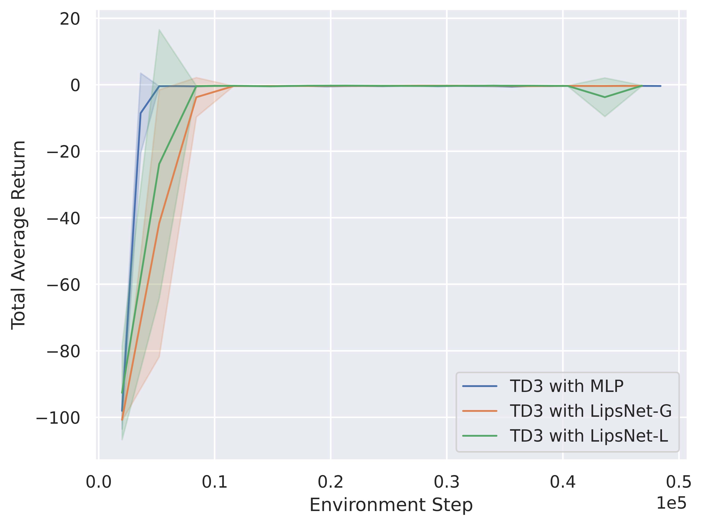
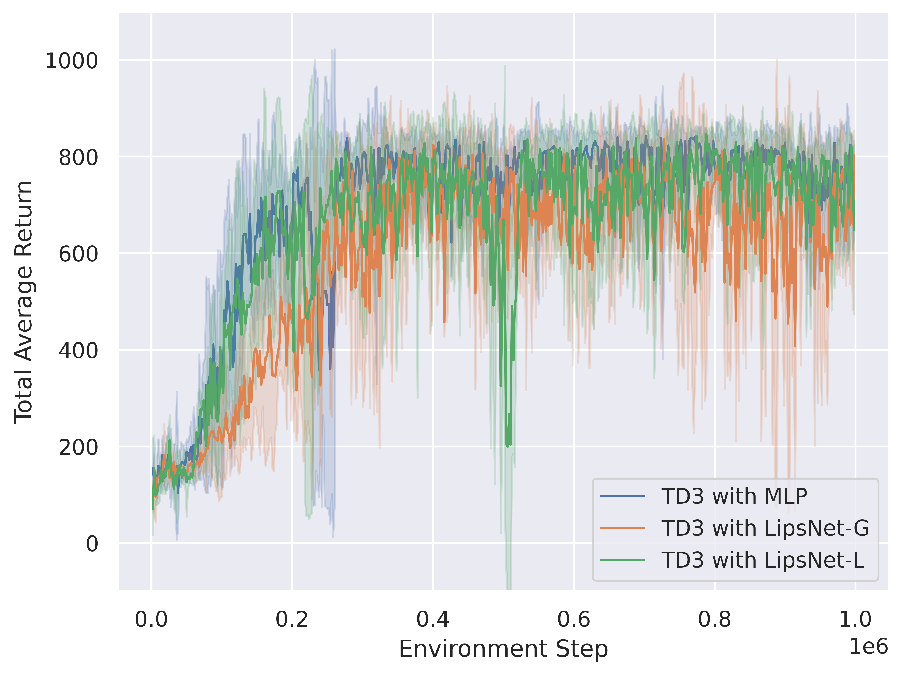
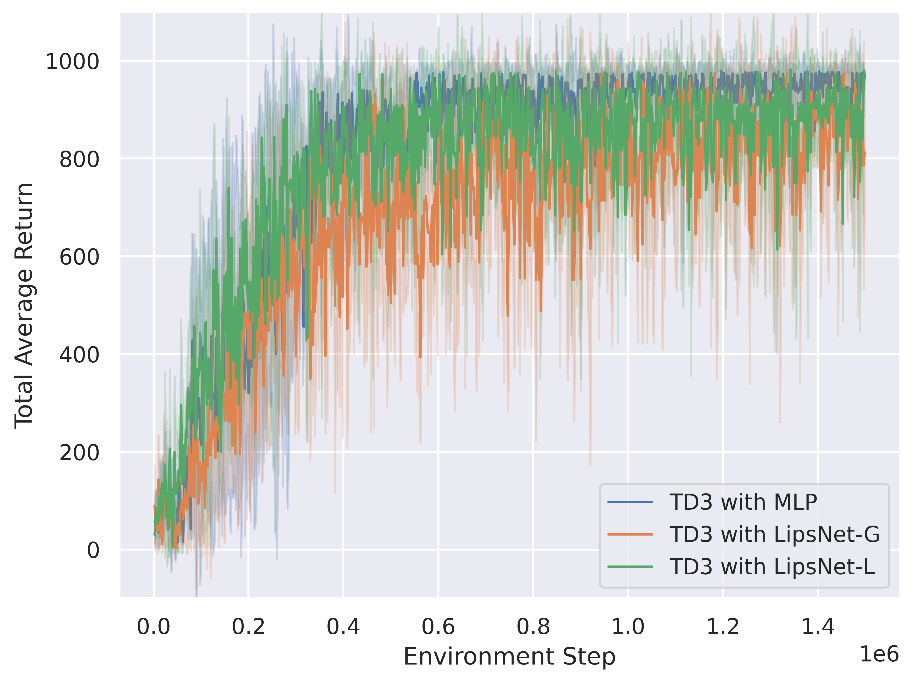
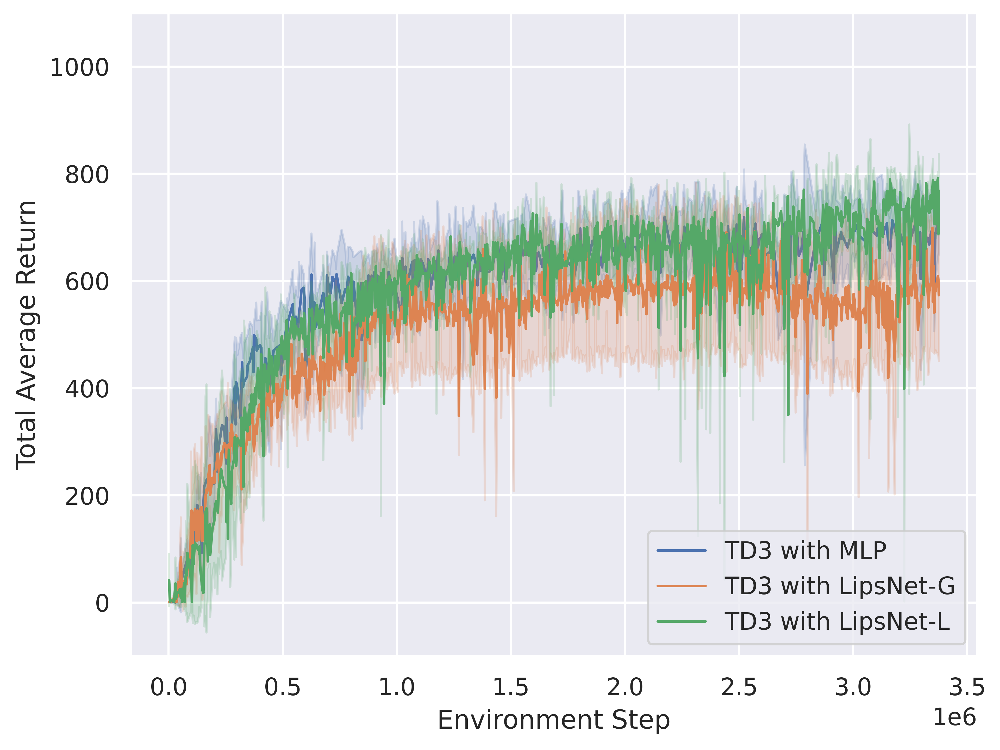
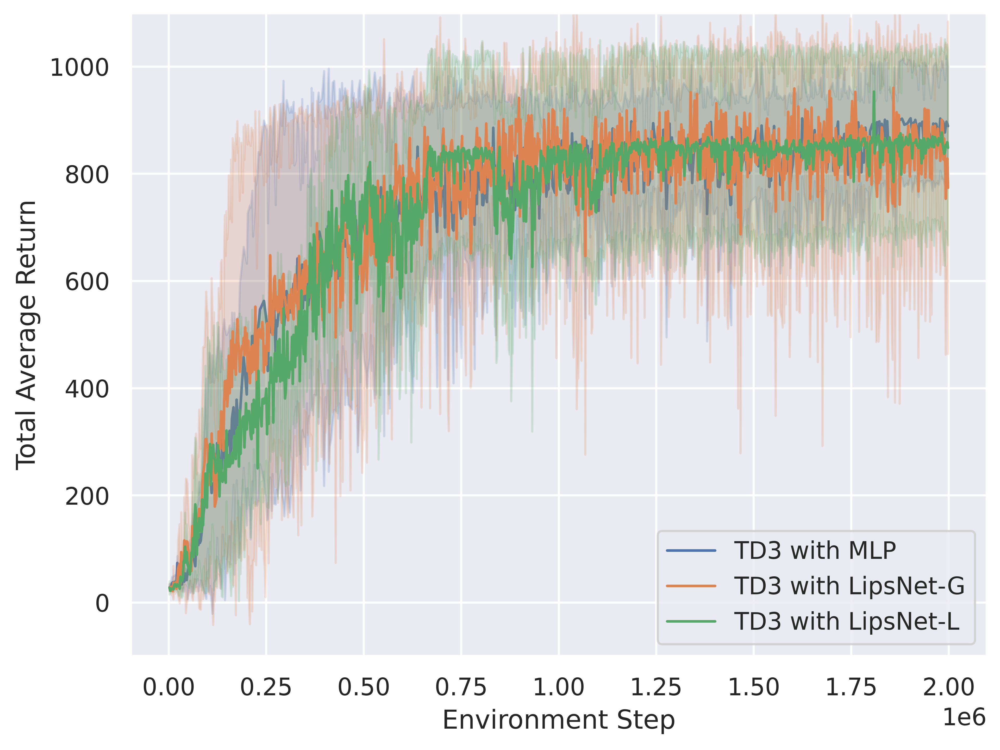

# ICML 2023 Rebuttal: LipsNet

## For reviewer \#oVCx

### (1). About sample efficiency
All of the reward curves are shown below.

There is not obvious reduce of sample efficiency.

- LQR

- Vehicle Trajectory Tracking

- DMControl Cartpole

- DMControl Reacher

- DMControl Cheetah

- DMControl Walker

### (2). Explanation for how LipsNet-G leads to higher fluctuation

As for the Cartpole environment, it only needs few steps to reach stability.

The maximum steps in DMControl are 1000. But Cartpole only needs about 200 steps to become stable, as the following videos show.

- Cartpole: TD3 (MLP)

https://user-images.githubusercontent.com/122627853/226195477-dfc5bdd5-eb6d-4b27-9898-fbd7c65dee6a.mov

 

- Cartpole: TD3 (LipsNet-G)

https://user-images.githubusercontent.com/122627853/226195479-dcb3ad2d-3526-4ddf-a864-93bbe3797a68.mov

 

- Cartpole: TD3 (LipsNet-L)

https://user-images.githubusercontent.com/122627853/226195489-8aebf3a0-614a-4897-8f60-7ddcc20b12e7.mov

 

When the global Lipschitz continuity holds, all states have the same Lipschitz constant. The Cartpole exhibits rapid changes in action when it points down, and small changes in action when it is stable in upright upward. To ensure good performance, LipsNet-G learns a large global Lipschitz constant to capture the rapid changing action. However, Cartpole only needs few steps to reach stability (the max steps are 1000 in dmc, but cartpole only needs about 200 steps to be stable). For LipsNet-G, the remaining 800 steps after stabilization is also under large Lipschitz constant, which leads to large action fluctuation. As a result, LipsNet-G's overall fluctuation ratio exceeds those of MLP. This is precisely why we proposed LipsNet-L, which can learn different local Lipschitz constants for different states.

 

In the following videos, we add observation noise.

The noise is uniformly distributed between [-0.2, -0.2, -0.2, -0.3, -0.3] and [ 0.2,  0.2,  0.2,  0.3,  0.3].

- Cartpole: TD3 (MLP) with observation noise

https://user-images.githubusercontent.com/122627853/226195497-73705823-bb0b-41d5-8ff6-d5218beab923.mov

 

- Cartpole: TD3 (LipsNet-G) with observation noise

https://user-images.githubusercontent.com/122627853/226195508-9f90e5e9-ea07-43ec-9f78-80582fa5a3d5.mov

 

- Cartpole: TD3 (LipsNet-L) with observation noise

https://user-images.githubusercontent.com/122627853/226195518-15b835cb-b7e5-4dc4-a9c9-eb1143b5b918.mov

 
